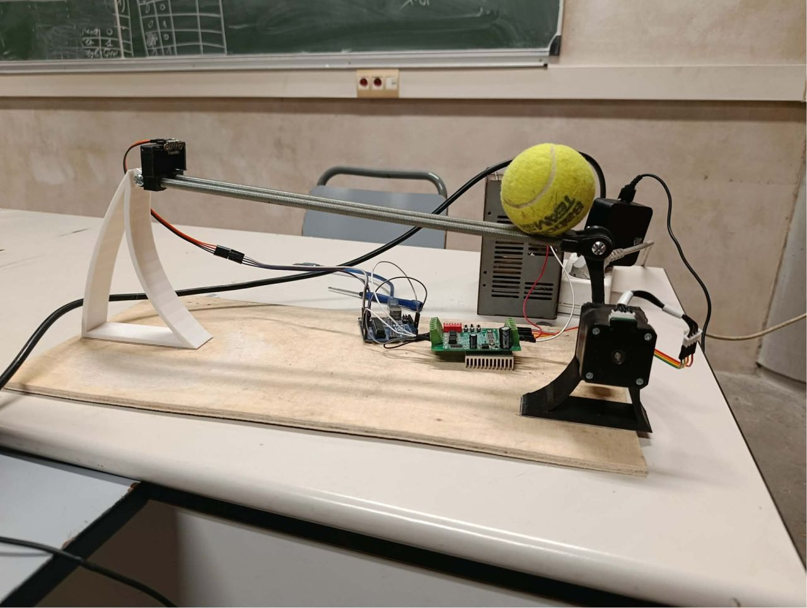
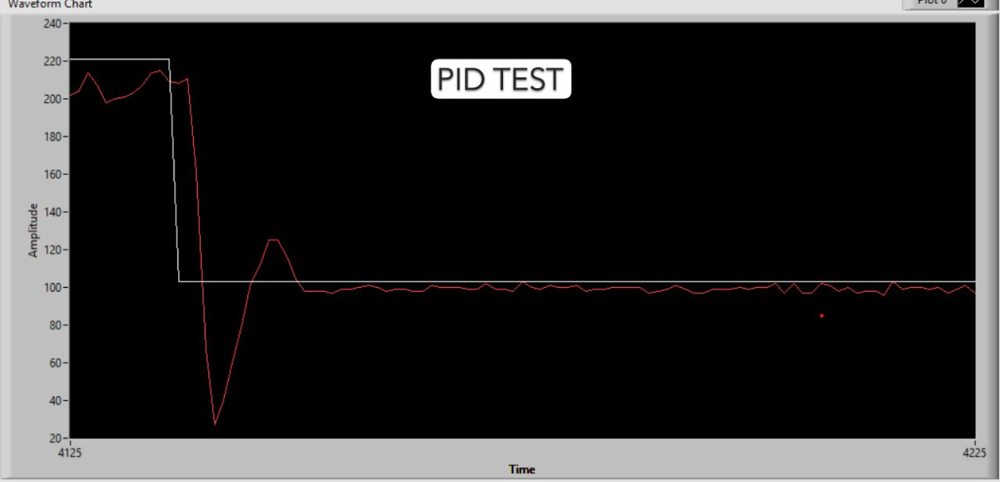
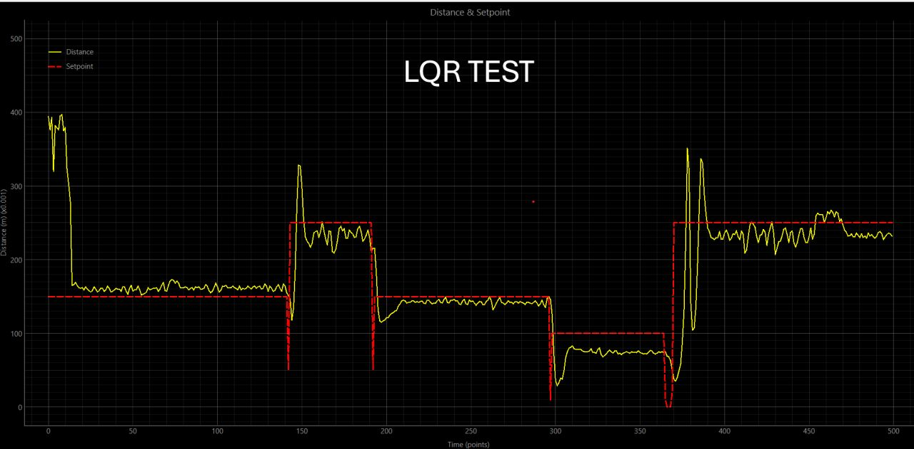

# Ball and Beam Control System

## Overview
A real-time control system that stabilizes a ball on a beam using an Arduino, a stepper motor, and a Time-of-Flight (ToF) sensor.

The system measures the ball position and adjusts the beam angle to maintain a desired position.

Two control strategies were implemented and compared:
- PID control
- LQR (Linear Quadratic Regulator)

## Hardware
- Arduino
- Stepper motor
- Time-of-Flight distance sensor
- Ball and beam mechanism

## Software
- Embedded C / Arduino
- Real-time control loop
- Sensor feedback processing

## Control Methods

### PID Controller
Classical feedback controller based on error correction.

### LQR Controller
State-space optimal control method that minimizes a cost function for better stability and performance.

## Results
Both controllers were tested and their responses were plotted:
- PID: simple and effective but with some overshoot  
- LQR: smoother response with improved stability  

## Images

### PID Response

### LQR Response

## Demo

## What I Learned
- Implementation of real-time control systems  
- Difference between PID and LQR control  
- Sensor integration and noise handling  
- System tuning and performance analysis